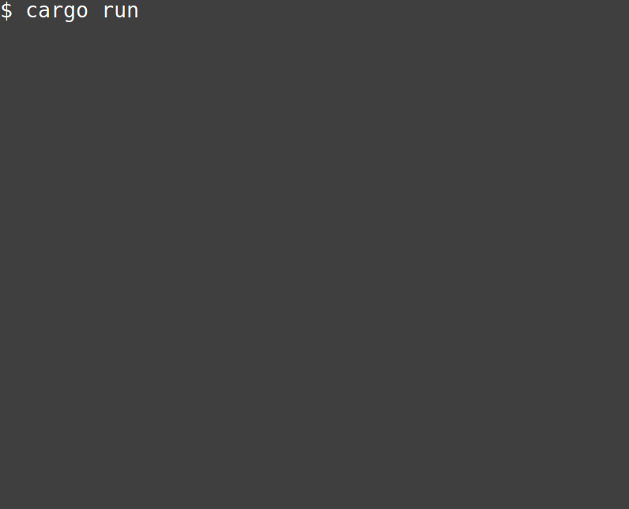

# minimal-game

This is a minimally "complete" game created in Rust. It has a
keyboard-controlled player, some enemies/obstacles, and a goal to reach. It's
hard to define what exactly makes a game "complete", but these three things
together do at least make something you can play.

## Acknowledgements

The sources of the assets used in this game are linked below:

* [Bard Character](http://finalbossblues.com/timefantasy/freebies/bard-character-with-animations/)
* [Grim Reaper](http://finalbossblues.com/timefantasy/freebies/grim-reaper-sprites/)
* [Trees](http://finalbossblues.com/timefantasy/freebies/more-trees/)
* [Pink Trees](http://finalbossblues.com/timefantasy/freebies/pink-trees/)

These are all free assets (see each link for the specific licencing details).
Please consider supporting the artist(s) by buying some of their paid assets.
Game development would be much more difficult without them and their work.
